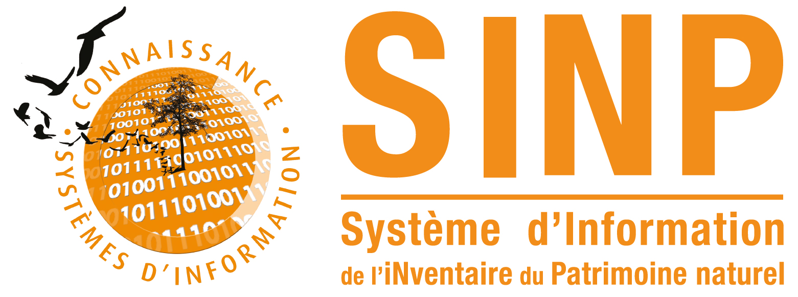

# ODKform

Travail réalisé dans le cadre de l'[Appel à projet 2021 pour l'amélioration du SINP](https://sinp.naturefrance.fr/appels-a-projet-2021-pour-lamelioration-du-sinp/) lancé par l'UMS Patrinat le 26 avril 2021.

 

_________

 

# Objectifs
La mise en conformité des données naturalistes au standard « occurrence de taxon » est chronophage et nécessite des compétences techniques de gestion de données. Cela représente un frein à la mutualisation des données et donc à leur dans le SINP.
Les données sont de plus en plus collectées sur le terrain via les smartphones des naturalistes avec diverses applications « propriétaires » et non génériques.

[ODK](https://www.getodk.org) est une suite de logiciels libres qui permet la collecte de données sur le terrain, dans des environnements contraints (faible couverture réseau, matériel standard). De nombreux acteurs du SINP et Parcs Nationaux l’utilisent pour leurs besoins de saisie mobile de données opportunistes ou pour la mise en œuvre de protocoles particuliers.

Les CEN d’Occitanie et de Nouvelle-Aquitaine utilisent la solution depuis 2015 et ont développé de nombreux formulaires pour différents publics. L’adoption de cet outil par les naturalistes des deux structures est unanime : 
* gain de temps (pas de double saisie, formulaire optimisé), 
* gain de qualité de la donnée (référentiels à jour et saisie dirigée limitent les erreurs)…
[XLSForm](https://xlsform.org/en/) est la norme, dérivée d’XForms, qui permet de décrire, sans connaissance informatique particulière, les formulaires affichés par https://docs.getodk.org/collect-intro/ (et KoboToolbox, Enketo, ESRI…).

Proposer un formulaire naturaliste pour [ODK Collect](https://docs.getodk.org/collect-intro/), conforme au standard du SINP, dans le [XLSForm](https://xlsform.org/en/), permettrait de réduire très fortement le temps consacré à la mise en conformité des données. Le format XLSForm facilitera aussi son appropriation par des structures souhaitant développer leur propre formulaire.

Les données sont consolidées au sein d’un serveur « [ODK Central](https://docs.getodk.org/central-intro/) » qui est interrogeable via une [API REST « ODATA »](https://odkcentral.docs.apiary.io/) que nous proposons de mettre en place pour la durée du projet, le temps qu’une institution propose ce service.
Il pourra servir de démonstrateur aux structures porteuses du SINP (pôles thématiques, plateformes régionales, INPN).
# 2 stratégies possibles
1. adapter un formualire existant décrit [ici](https://si.cen-occitanie.org/formulaire_de_terrain_opendatakit_2020-01-24/) et [là](https://forum.getodk.org/t/odk-to-collect-species-and-habitats-localities-as-pressure-and-threats-to-ecosystems/26332
).
2. créer un formulaire ex-nihilo sur la base du standard

C'est la première stratégie que nous allons mettre en oeuvre dans un premier temps.

# Développement d'un formulaire ex-nihilo
Le standard présenté [ici](https://standards-sinp.mnhn.fr/wp-content/uploads/sites/16/versionhtml/occtax_v2/index.htm) a été transposé dans un [fichier excel de questions](https://github.com/Projet-ODK-SINP/standart/blob/main/occtaxODK.xlsx). Les nommenclatures ont été transposées en csv [ici](https://github.com/Projet-ODK-SINP/standart/blob/main/nomenclatures_sinp.csv) . Elle seront la base de la feuille choices de notre formulaire.
