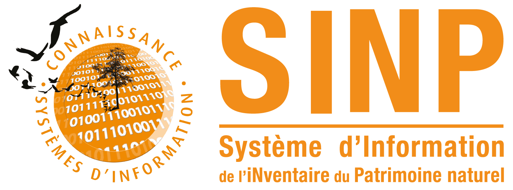
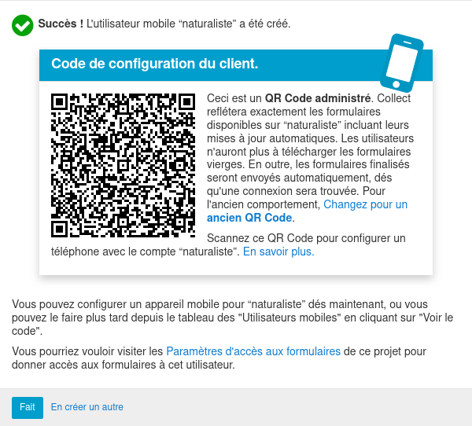
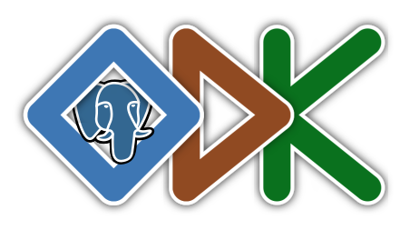
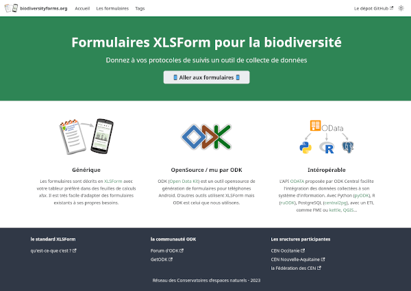

# ODKform

Travail réalisé dans le cadre de l'[Appel à projet 2021 pour l'amélioration du SINP](https://sinp.naturefrance.fr/appels-a-projet-2021-pour-lamelioration-du-sinp/) lancé par l'UMS Patrinat le 26 avril 2021.

 

_________

 

# Objectifs
La mise en conformité des données naturalistes au standard « Occurrences de Taxon » v 2.0 est chronophage et nécessite des compétences techniques de gestion de données. Cela représente un frein à la mutualisation des données et donc à leur intégration dans le SINP.
Les observations sont de plus en plus collectées sur le terrain via les smartphones des naturalistes et diverses applications « propriétaires » et non génériques.

[ODK](https://www.getodk.org) est une suite de logiciels libres qui permet la collecte de données sur le terrain, dans des environnements contraints (faible couverture réseau, matériel standard). De nombreux acteurs du SINP et Parcs Nationaux l’utilisent pour leurs besoins de saisie mobile de données opportunistes ou pour la mise en œuvre de protocoles particuliers.

Les CEN d’Occitanie et de Nouvelle-Aquitaine utilisent la solution depuis 2015 et ont développé de nombreux formulaires pour différents publics. L’adoption de cet outil par les naturalistes des deux structures est unanime : 
* gain de temps (pas de double saisie, formulaire optimisé), 
* gain de qualité de la donnée (référentiels à jour et saisie dirigée limitent les erreurs)
[XLSForm](https://xlsform.org/en/) est la norme, dérivée d’XForms, qui permet de décrire, sans connaissance informatique particulière, les formulaires affichés par https://docs.getodk.org/collect-intro/ (et KoboToolbox, Enketo, ESRI…).

Proposer un formulaire naturaliste pour [ODK Collect](https://docs.getodk.org/collect-intro/), conforme au standard du SINP, selon la norme [XLSForm](https://xlsform.org/en/), permettrait de réduire très fortement le temps consacré à la mise en conformité des données.
Le format XLSForm facilitera aussi son appropriation par des structures souhaitant développer leur propre formulaire.

Les données sont consolidées au sein d’un serveur « [ODK Central](https://docs.getodk.org/central-intro/) » qui est interrogeable via une [API REST « ODATA »](https://odkcentral.docs.apiary.io/) que nous proposons de mettre en place pour la durée du projet, le temps qu’une institution propose ce service.

Il pourra servir de démonstrateur aux structures porteuses du SINP (pôles thématiques, plateformes régionales, INPN).

# Deux stratégies possibles
1. adapter un formulaire existant décrit [ici](https://si.cen-occitanie.org/formulaire_de_terrain_opendatakit_2020-01-24/) et [là](https://forum.getodk.org/t/odk-to-collect-species-and-habitats-localities-as-pressure-and-threats-to-ecosystems/26332
).
2. créer un formulaire ex-nihilo sur la base du standard
**C'est le choix que nous avons fait et qui est présenté ici**

 

# Développement d'un formulaire ex-nihilo
Le standard présenté [ici](https://standards-sinp.mnhn.fr/wp-content/uploads/sites/16/versionhtml/occtax_v2/index.htm) a été transposé dans un [fichier excel de questions](https://github.com/Projet-ODK-SINP/standart/blob/main/occtaxODK.xlsx). Les nomenclatures ont été transposées en csv [ici](https://github.com/Projet-ODK-SINP/standart/blob/main/nomenclatures_sinp.csv) . Elle sont la base de la feuille "_choices_" de notre formulaire.

## Le formulaire OccTaxODK
Disponible [ici](https://github.com/Projet-ODK-SINP/ODKform/blob/main/OccTaxODK.xlsx) il peut être édité avec Excel ou LibreOffice. Il est documenté (colonnes _SINP_concept_principal_, _SINP_attribut_	et _SINP_description_).

Un tutoriel pour sa prise en main est disponible [ici](./manuel_utilisation.md).

Les requêtes SQL permettant de générer, à partir de TAXREF v16, les référentiels qui sont utilisés par le formulaire, sont proposées [ici](./sources/taxref/generation_taxref_odk.sql).

# Mise en place d'un serveur ODK Central
Il est accessible à l'adresse suivante : 
 

https://aap-odk-sinp.cen-nouvelle-aquitaine.dev
 

Un utilisateur mobile _naturaliste_ a été créé, le QRCode a flasher avec ODK Collect pour tester le formulaire sur son téléphone est celui ci-dessous :
 

# Intégration des données recueillies à un SI
## A l'aide de FME ou d'un ETL
Voir [ici](./recuperation_des_donnees_api_et_etl.md)
## Dans PostgreSQL à l'aide de fonction pl-python
Voir [ici](recuperation_des_donnees_dans_postgresql.md)
 

# D'autres formulaires…
A l'automne 2022, les CEN d'Occitanie et de Nouvelle-Aquitaine ont publié le site https://biodiversityforms.org afin de partager des formulaires XLSForm relatifs à la conservation de la nature et à la connaissance des espèces et des habitats.

Il serait intéressant et utile que les formulaires développés pour des protocoles standards y soient référencés et partagés.
Une mutualisation des formulaires et des traitements associés aux données collectées bénéficieraient à de nombreux acteurs.

