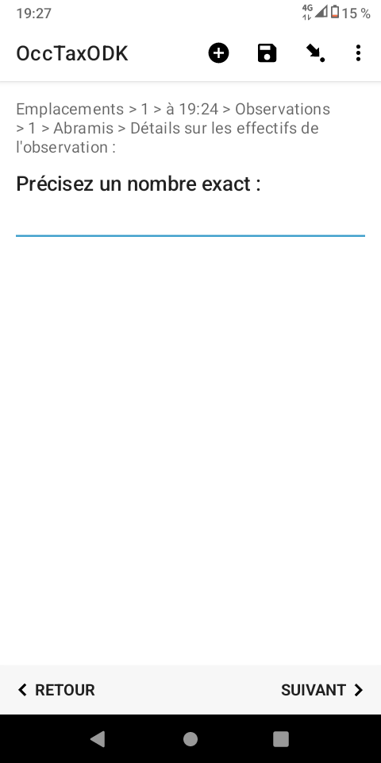
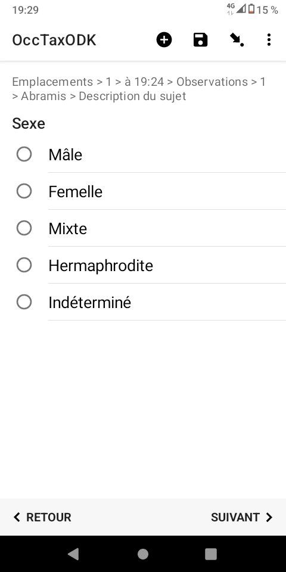
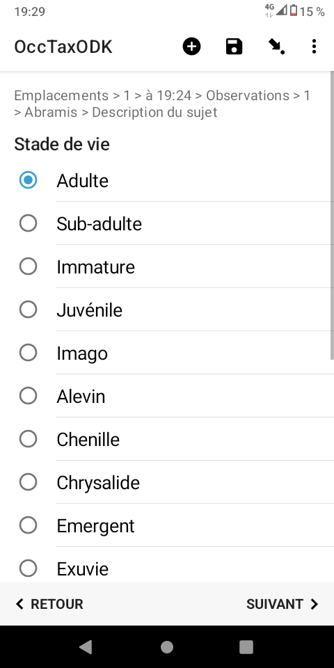
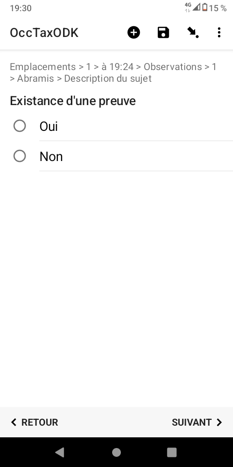

# Manuel d'utilisation du formulaire
## Configuration d'ODK Collect
### QRcode
Il vous permets d'accéder aux formulaires mis à votre disposition sur le serveur ODK Central
Vous pouvez connecter votre application à plusieurs projets/sevreurs en utilisant différnets QRCode
Cela vous permet par exemple de collecter des données pour différentes structures, ou de participer à plusieurs groupes thématiques (ex 1 QRCode "entomologie" et 1 QRCode "Bota")
## Utilisation
1. Page d'accueil du formulaire

2. Préférences de l'utilisateur
* Souhaitez vous modifier les paramétrages par défaut

* Vous pouvez définir les questions qui apparaîtront ou non dans votre formulaire.
Par exemple, vous ne relèverez toujours que des points GPS, les questions relatives aux lignes et aux polygones vous sont inutiles.
Ces préférences peuvent être modifiées à chaque démarrage de formulaire.

3. Informations relatives à l'utilisateur

4. Quelle type de géométrie souhaitez vous créer ?
* Selon les préférences renseignées plus haut, certaines options n’apparaîtront pas.

* Choix du point

5. Création d'une première observation sur ce premier emplacement
* Quel type d'observation allez vous réaliser (Faune ? Flore ? Fonge ?)

* Choix du taxon
    > **Note**
    > Taper les 3 premières lettres du taxon rechercher pour voir apparaître les propositions.
    > Les noms valides sont mis en exergue.

6. Quel est le type d'observation ?

