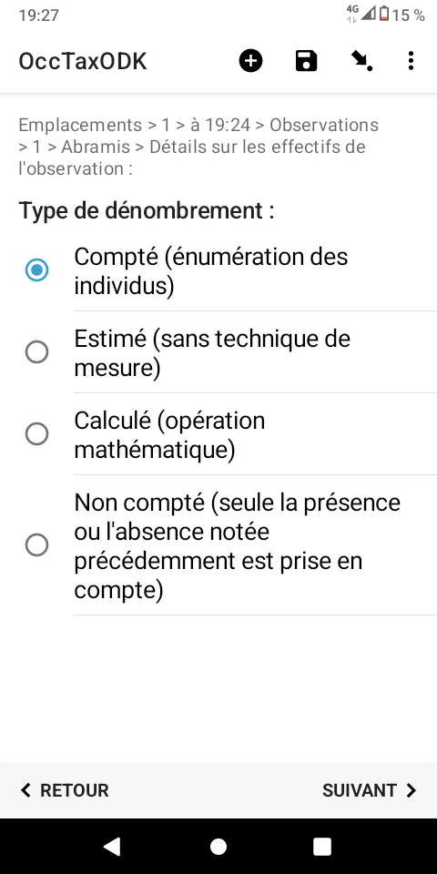
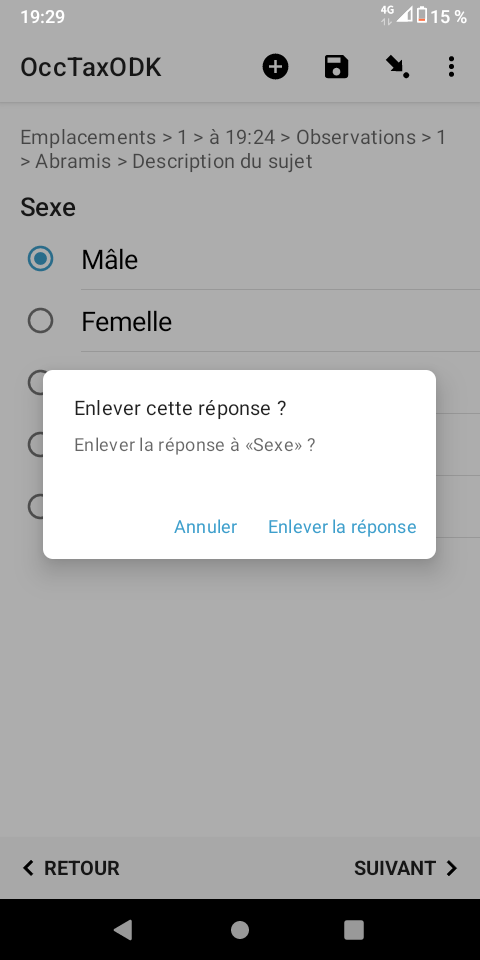

# Manuel d'utilisation du formulaire
## Configuration d'ODK Collect
### QRcode
Il vous permets d'accéder aux formulaires mis à votre disposition sur le serveur ODK Central
Vous pouvez connecter votre application à plusieurs projets/serveurs en utilisant différents QRCode
Cela vous permet par exemple de collecter des données pour différentes structures, ou de participer à plusieurs groupes thématiques (ex 1 QRCode "entomologie" et 1 QRCode "Bota")
## Utilisation
#### 1. Page d'accueil du formulaire

#### 2. Préférences de l'utilisateur
* Souhaitez vous modifier les paramétrages par défaut

* Vous pouvez définir les questions qui apparaîtront ou non dans votre formulaire.
Par exemple, vous ne relèverez toujours que des points GPS, les questions relatives aux lignes et aux polygones vous sont inutiles.
Ces préférences peuvent être modifiées à chaque démarrage de formulaire.

#### 3. Informations relatives à l'utilisateur

#### 4. Quelle type de géométrie souhaitez vous créer ?
* Selon les préférences renseignées plus haut, certaines options n’apparaîtront pas.

* Choix du point
    > **Note**
    > Ici nous avons choisi de créer un point automatiquement.
    > Il sera créé dés que la précision du GPS sera sous le seuil défini dans vos préférences (par défaut 5m)

> **Note**
> Mais nous pouvons forcer l'enregistrement du point et outrepasser le seuil de précision
> Ici la précision de 15 est suffisante, inutile d'attendre mieux.

#### 5. Création d'une première observation sur ce premier emplacement
* Quel type d'observation allez vous réaliser (Faune ? Flore ? Fonge ?)

* Choix du taxon
> **Note**
> Taper les 3 premières lettres du taxon recherché pour voir apparaître les propositions.
> Les noms valides sont mis en exergue.

#### 6. Quel est le type d'observation ?

#### 7. Quel est donc cet effectif ?

#### 8. On peut ajouter une description à l'observation

#### 9. On peut aussi la contextualiser

#### 10. Précision du type de contact

#### 11. Précision de la méthode de détermination

#### 12. Précision de l'état biologique de l'individu

#### 13. Précision de la naturalité
Cette question peut-être masquée dans les préférences

#### 14. Sexage
> **Astuce**
> un appui long sur une option sélectionnée par erreur permet de la supprimer.

#### 15. Stade de vie

#### 16. Comportement

#### 17. Précision du statut biogéographique du taxon
Cette question peut-être masquée dans les préférences.

#### 18. Précision du statut biologique

#### 19. Précision du statut biogéographique du taxon

#### 20. Précision de l'altitude
Cette question peut-être masquée dans les préférences.

#### 21. Précision de la profondeur
Cette question peut-être masquée dans les préférences.

#### 22. Date de détermination
Si le déterminateur ou la date de détermination diffèrent de l'observateur et de la date d'observation, vous pouvez renseigner ces informations.

#### 23. Commentaire général sur l'observation
Si le déterminateur ou la date de détermination diffèrent de l'observateur et de la date d'observation, vous pouvez renseigner ces informations.

#### 24. Fin de cette première observation
Si vous souhaitez en ajouter une sur cette emplacement, vous retournerez à l'étape 5 pour un nouveau tour de boucle
Si non vous arriverez à l'étape suivante (25)

#### 25. Affichage de la synthèse des taxons observés sur cet emplacement

#### 26. Fin de ce premier emplacement
Si vous souhaitez en ajouter un dans cette session, vous retournerez à l'étape 4
Si non vous arriverez à la fin du formulaire

#### 27. Fin du formulaire
Vous pouvez l’enregistrer comme ébauche (_Draft_) afin d'y revenir plus tard, 
ou l'envoyer au serveur (dés qu'une connexion réseau sera disponible)

