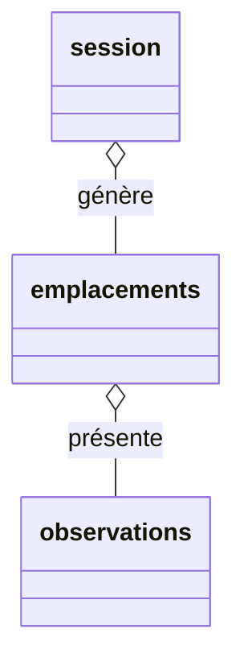

# Récupération des données collectées dans une base de données PostGIS

Utilisation de [pl-pyODK](https://github.com/mathieubossaert/pl-pyodk)

## Edition du fichier de configuration de pyODK

```toml
[central]
base_url = "https://aap-odk-sinp.cen-nouvelle-aquitaine.dev"
username = "xx@yyyyyyy.org"
password = "xxxxxxxxxxxxxx"
default_project_id = 1
```

```sql
SELECT plpyodk.odk_central_to_pg(
	1,                    -- the project id
	'occ_tax_odk/draft'::text,     -- form ID
	'odk_central'::text,  -- schema where to create tables and store data
	'',                   -- the filter "clause" used in the API call
	'point_auto_5,point_auto_10,point_auto_15,point,ligne,polygone'::text -- json (geo)columns to ignore
);
```
Cela va automatiquement :

 * demander à Central les soumissions du formulaire correspondant au filtre (si filtre)
 * obtenir les données
 * créer les tables correspondant aux soumissions et au "repeat group" dans le schéma "odk_data" de ma base de données. Un attribut texte par question du formulaire pour stocker ces données 
   * odk_central.occ_tax_odk_submissions_data
   * odk_central.occ_tax_odk_emplacements_data
   * odk_central.occ_tax_odk_observations_data
 * le dernier paramètre liste la question à ignorer dans la récusrion de l'exploration json (colonnes geowidgets)
 * alimenter ces tables avec les données récupérées

Et au prochain appel :

 * Vérifier la présence de nouvelles questions dans le formulaire
 * les créer dans les tables le cas échéant si nécessaire
 * insérer les nouvelles données (seulement celles non encore présente)

```sql
CREATE TABLE IF NOT EXISTS odk_central.occ_tax_odk_submissions_data
(
    data_id text COLLATE pg_catalog."default",
    affichage_altitude text COLLATE pg_catalog."default",
    affichage_profondeur text COLLATE pg_catalog."default",
    ajout_accompagnateur text COLLATE pg_catalog."default",
    "attachmentsExpected" text COLLATE pg_catalog."default",
    "attachmentsPresent" text COLLATE pg_catalog."default",
    autre_nomorganisme text COLLATE pg_catalog."default",
    changer_preferences text COLLATE pg_catalog."default",
    choix text COLLATE pg_catalog."default",
    date_heure text COLLATE pg_catalog."default",
    "deviceId" text COLLATE pg_catalog."default",
    edits text COLLATE pg_catalog."default",
    email_utilisateur text COLLATE pg_catalog."default",
    "emplacements@odata.navigationLink" text COLLATE pg_catalog."default",
    "formVersion" text COLLATE pg_catalog."default",
    __id text COLLATE pg_catalog."default",
    identite text COLLATE pg_catalog."default",
    "instanceID" text COLLATE pg_catalog."default",
    "instanceName" text COLLATE pg_catalog."default",
    mail text COLLATE pg_catalog."default",
    nb_lettres text COLLATE pg_catalog."default",
    nombre_lettres text COLLATE pg_catalog."default",
    nommage_site text COLLATE pg_catalog."default",
    nomorganisme text COLLATE pg_catalog."default",
    preferences_utilisateur text COLLATE pg_catalog."default",
    preremplissage text COLLATE pg_catalog."default",
    presentation text COLLATE pg_catalog."default",
    renseigner_naturalite text COLLATE pg_catalog."default",
    renseigner_statut_biogeo text COLLATE pg_catalog."default",
    "reviewState" text COLLATE pg_catalog."default",
    status text COLLATE pg_catalog."default",
    "submissionDate" text COLLATE pg_catalog."default",
    "submitterId" text COLLATE pg_catalog."default",
    "submitterName" text COLLATE pg_catalog."default",
    tolerance text COLLATE pg_catalog."default",
    tolerance_pour_creation_point_auto text COLLATE pg_catalog."default",
    "updatedAt" text COLLATE pg_catalog."default",
    username text COLLATE pg_catalog."default",
    utiliser_geopoint text COLLATE pg_catalog."default",
    utiliser_geoshape text COLLATE pg_catalog."default",
    utiliser_geotrace text COLLATE pg_catalog."default",
    CONSTRAINT occ_tax_odk_submissions_data_data_id_key UNIQUE (data_id)
);

CREATE TABLE IF NOT EXISTS odk_central.occ_tax_odk_emplacements_data
(
    data_id text COLLATE pg_catalog."default",
    affiche_recap_obs_especes text COLLATE pg_catalog."default",
    heure_localite text COLLATE pg_catalog."default",
    __id text COLLATE pg_catalog."default",
    latitude text COLLATE pg_catalog."default",
    ligne text COLLATE pg_catalog."default",
    liste_especes_observees text COLLATE pg_catalog."default",
    longitude text COLLATE pg_catalog."default",
    methode_georef text COLLATE pg_catalog."default",
    nature_objetgeo text COLLATE pg_catalog."default",
    nom_lieu text COLLATE pg_catalog."default",
    "observations@odata.navigationLink" text COLLATE pg_catalog."default",
    point text COLLATE pg_catalog."default",
    point_auto_10 text COLLATE pg_catalog."default",
    point_auto_15 text COLLATE pg_catalog."default",
    point_auto_5 text COLLATE pg_catalog."default",
    polygone text COLLATE pg_catalog."default",
    precision_geometrie text COLLATE pg_catalog."default",
    "__Submissions-id" text COLLATE pg_catalog."default",
    CONSTRAINT occ_tax_odk_emplacements_data_data_id_key UNIQUE (data_id)
);

CREATE TABLE IF NOT EXISTS odk_central.occ_tax_odk_observations_data
(
    data_id text COLLATE pg_catalog."default",
    altitudemax text COLLATE pg_catalog."default",
    altitudemin text COLLATE pg_catalog."default",
    altitudemoyenne text COLLATE pg_catalog."default",
    autre_nomorganisme_determinateur text COLLATE pg_catalog."default",
    cd_nom_animalia text COLLATE pg_catalog."default",
    cd_nom_fungi text COLLATE pg_catalog."default",
    cd_nom_plantae text COLLATE pg_catalog."default",
    commentaire text COLLATE pg_catalog."default",
    datedebut text COLLATE pg_catalog."default",
    date_determination text COLLATE pg_catalog."default",
    datefin text COLLATE pg_catalog."default",
    denombrement text COLLATE pg_catalog."default",
    denombrementmax text COLLATE pg_catalog."default",
    denombrementmin text COLLATE pg_catalog."default",
    determinateur text COLLATE pg_catalog."default",
    echantillon text COLLATE pg_catalog."default",
    especes_observees text COLLATE pg_catalog."default",
    groupe text COLLATE pg_catalog."default",
    heuredebut text COLLATE pg_catalog."default",
    heurefin text COLLATE pg_catalog."default",
    __id text COLLATE pg_catalog."default",
    idsinp_occtax text COLLATE pg_catalog."default",
    lb_nom_animalia text COLLATE pg_catalog."default",
    lb_nom_fungi text COLLATE pg_catalog."default",
    lb_nom_plantae text COLLATE pg_catalog."default",
    lib_obs text COLLATE pg_catalog."default",
    nomorganisme_determinateur text COLLATE pg_catalog."default",
    objet_denombrement text COLLATE pg_catalog."default",
    obs_contexte text COLLATE pg_catalog."default",
    obs_description text COLLATE pg_catalog."default",
    obs_technique text COLLATE pg_catalog."default",
    occ_comportement text COLLATE pg_catalog."default",
    occ_etat_biologique text COLLATE pg_catalog."default",
    occ_methode_determination text COLLATE pg_catalog."default",
    occ_naturalite text COLLATE pg_catalog."default",
    occ_sexe text COLLATE pg_catalog."default",
    occ_stade_vie text COLLATE pg_catalog."default",
    occ_statut_biogeographique text COLLATE pg_catalog."default",
    occ_statut_biologique text COLLATE pg_catalog."default",
    precision_altitude text COLLATE pg_catalog."default",
    precision_determination text COLLATE pg_catalog."default",
    precision_profondeur text COLLATE pg_catalog."default",
    preuve_existante text COLLATE pg_catalog."default",
    preuve_non_numerique text COLLATE pg_catalog."default",
    prise_image text COLLATE pg_catalog."default",
    profondeurmax text COLLATE pg_catalog."default",
    profondeurmin text COLLATE pg_catalog."default",
    profondeurmoyenne text COLLATE pg_catalog."default",
    recherche_animalia text COLLATE pg_catalog."default",
    recherche_fungi text COLLATE pg_catalog."default",
    recherche_plantae text COLLATE pg_catalog."default",
    statut_observation text COLLATE pg_catalog."default",
    "__Submissions-emplacements-id" text COLLATE pg_catalog."default",
    type_denombrement text COLLATE pg_catalog."default",
    type_observation text COLLATE pg_catalog."default",
    url_preuve_numerique text COLLATE pg_catalog."default",
    version_taxref text COLLATE pg_catalog."default",
    CONSTRAINT occ_tax_odk_observations_data_data_id_key UNIQUE (data_id)
);
```

Ces trois tables correspondent et décrivent la logique du formulaire.
Pour chaque session de terrain, nous pouvons créer plusieurs emplacments ( _repeat_ **emplacements** )
Et pour chacun de ces emplacements plusieurs observations ( _repeat_ **observations**// )



Reconstituer les données d'observation revient donc à faire une requête avec 2 jointures :
```sql
SELECT observations.data_id, identite, "instanceID", "instanceName", COALESCE(mail, email_utilisateur) AS email, nomOrganisme, autre_nomOrganisme, choix, date_heure, "formVersion", "reviewState", "submissionDate", "updatedAt",
-- les attributs de l'emplacement
affiche_recap_obs_especes, heure_localite,latitude, ligne, liste_especes_observees, longitude, methode_georef, nature_objetgeo, nom_lieu, "observations@odata.navigationLink", point, point_auto_10, point_auto_15, point_auto_5, polygone, precision_geometrie,
-- les attributs de l'observation
altitudemax, altitudemin, altitudemoyenne, autre_nomorganisme_determinateur, cd_nom_animalia, cd_nom_fungi, cd_nom_plantae, commentaire, datedebut, date_determination, datefin, denombrement, denombrementmax, denombrementmin, determinateur, echantillon, especes_observees, heuredebut, heurefin, idsinp_occtax, lb_nom_animalia, lb_nom_fungi, lb_nom_plantae, lib_obs, nomorganisme_determinateur, objet_denombrement, obs_contexte, obs_description, obs_technique, occ_comportement, occ_etat_biologique, occ_methode_determination, occ_naturalite, occ_sexe, occ_stade_vie, occ_statut_biogeographique, occ_statut_biologique, precision_altitude, precision_determination, precision_profondeur, preuve_existante, preuve_non_numerique, prise_image, profondeurmax, profondeurmin, profondeurmoyenne, statut_observation, type_denombrement, type_observation, url_preuve_numerique, version_taxref
FROM odk_central.occ_tax_odk_submissions_data AS submissions
JOIN odk_central.occ_tax_odk_emplacements_data AS emplacements ON "__Submissions-id" = submissions.__id
JOIN odk_central.occ_tax_odk_observations_data AS observations ON "__Submissions-emplacements-id" = emplacements.__id
```

